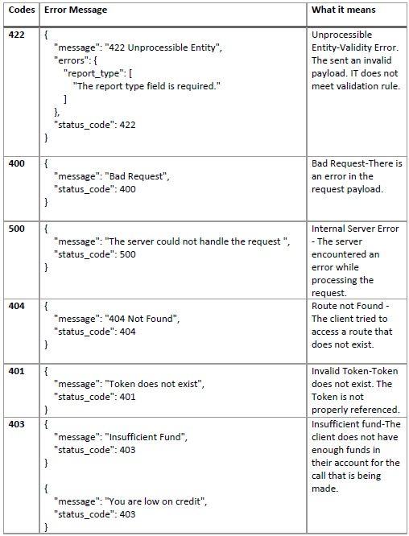
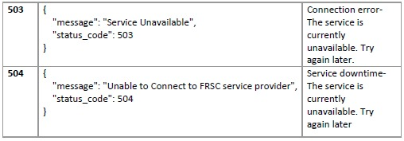

# Youverify Documentation for Identity

- The Youverify API is a RESTful web service for developers to programmatically interact with Youverify’s data and functionality.
- Every bit of data exchanged between clients and the API is JSON over HTTPS.
- The base URL for the Youverify Staging API is <https://api.staging.youverify.co> while the live API endpoint is <https://api.youverify.co>,
- All endpoint should be prefix with v1 e.g <https://api.staging.youverify.co/v1> for staging and while live is <https://api.youverify.co/v1>
- All sample requests in this documentation are formatted for cURL.
- All parameters, where relevant, are required unless otherwise specified.
- If you have questions about using the API, want to share some feedback, or have come across a bug you'd like to report, write us an email at developer@youverify.co
- Youverify API uses key based authentication method. You can get a key from settings(<https://developer.youverify.co>)

## Nigerian International Passport (NIP)

This endpoint lets you verify a passport ID.

Request Sample

```json http
{
  "method": "POST",
  "url": "https://api.staging.youverify.co/v1/identities/candidates/check",
  "headers": {
    "Content-Type": "application/json",
    "token": "{{token}}"
  },
  "body": "{ \n \"report_type\": \"identity\", \n \"type\": \"passport\", \n \"reference\": \"Axxxxxxxx\", [required] \n \"last_name\": \"John\", [ optional] \n \"first_name\": \"Doe\", [ optional] \n \"dob\": \"2000-01-01\", [ optional ] \n “subject_consent”: true [required] [Boolean] \n}"
}
```

Response

```json
 { 
  "data": 
  { 
   "id": "reports_7e9b2a5e-1c58-4cc9-a544-371d95d39a12", 
   "reference_id": "5d890625e8841", 
   "response": { 
   "first_name": "JOHN", 
   "last_name": "DOE", 
   "middle_name": "", 
   "dob": "2000-01-01", 
   "mobile": null, 
   "photo": "/9j/4AAQSkZJRgABAgEAYABgAAD//+xIdoMMG+J4NL65A33mbth9RutNh+MYdi //9k=", 
   "gender": "Male", 
   "issued_at": "ALAUSA, LAGOS", 
   "issued_date": "2018-10-30", 
   "expiry_date": "2023-10-29", 
   "reference_id": "Axxxxxxxx" 
   }, 
    "type": "passport",
    "task_created_by": "Inc Youverify" 
    }, 
"message": "Successful", 
"status_code": 200 
}
```

## Bank Verification Number (BVN)

This endpoints allows you to verify a BVN ID.

Request Sample

```json http
{
  "method": "post",
  "url": "https://api.staging.youverify.co/v1/identities/candidates/check",
  "headers": {
    "Content-Type": "application/json",
    "token": "{{token}}"
  },
  "body": "{ \n \"report_type\": \"identity\", \n \"type\": \"ibvn\", \n \"reference\": \"xxxxxxxxxxx\", [required] \n \"last_name\": \"John\", [ optional ] \n \"first_name\": \"Doe\", [ optional ] \n \"dob\": \"2000-01-01\", [ optional ] \n “subject_consent”: true [required] [Boolean] \n}"
}
```

Response

```json
{ 
"data": { 
"id": "reports_65376e11-387e-4e54-b2d9-7511bba9080d", 
"reference_id": "5d89e45394fc1", 
"response": { 
"first_name": "JOHN", 
"middle_name": "", 
"mobile": "xxxxxxxxxx", 
"last_name": "DOE", 
"dob": "01-Jan-00",
"photo": "/9j/4AAQSkZJRgABAgAAAQABAAD/2wBDAAgGBgcGBQgHBwcJCQgKDBQNDAsLDBkSEw8UHRofHh0aHBwgJC4nICIsIxwcKDcpLDAxNDQ0Hyc5PTgyPC4zNDL//MTgVFKBtDLt3Z71dhXYjx/IDnis6fAJAqe4unAA4xWfJMMHNc87XNVqhCcimA4PvTTIAOtMD/NVwMqmxd0BGgvUUcbvMc59Cf8AHFdnC4K4PNcdoIY3FxOxz0QZ/M/9k=" 
}, 
"type": "ibvn", 
"task_created_by": "Inc Youverify" 
}, 
"message": "Successful", 
"status_code": 200 
}
```

## Nigerian Driver's License (NDL)

This endpoint allows you to verify driver's license number.

Request Sample

**NB**: first_name and last_name does not affect the result but are needed by the API – The default can be left as is, just change the "reference" to the NDL number and also the DOB.

```json http
{
  "method": "post",
  "url": "https://api.staging.youverify.co/v1/identities/candidates/check",
  "headers": {
    "Content-Type": "application/json",
    "token": "{{token}}"
  },
  "body": "{ \n \"report_type\": \"identity\", \n \"type\": \"frsc\", \n \"reference\": \"xxxxxxxxxxxxx\", [required] \n \"last_name\": \"John\", [ leave as is] \n \"first_name\": \"Doe\", [leave as is] \n \"dob\": \"2000-01-01\", [ Required ] \n “subject_consent”: true [required] [Boolean] \n}"
}
```

Response

```json
 { 
"data": { 
"id": "reports_8c4088b0-b04c-4966-9c60-d235db186071",
"reference_id": "5d89e628ded9a", 
"response": { 
"residence_address_line1": "xxxxxxxxxx", 
"residence_town": "xxxxxxxxxx ", 
"residence_lga": "xxxxxxxxxx ", 
"residence_state": "Lagos", 
"application_first_issued_date": "2010-02-26", 
"dob": "2000-01-01”, 
"disability": "No", 
"facial_mark": "N", 
"first_state_of_issuance": "Lagos ", 
"first_name": "JOHN", 
"gender": "M", 
"glasses": "N", 
"height": null, 
"self_origin_lga": "xxxxxxxxxx", 
"license": { 
"class": "D", 
"description": "Motor vehicle other than motor cycle, taxi, stage carriage, an articulated vehicle or vehicle drawing a trailer. " 
}, 
"mobile": " xxxxxxxxxx ", 
"maiden_name": " xxxxxxxxxx ", 
"birth_country": "Nigeria ", 
"next_of_kin_phone_number": "xxxxxxxxxx ", 
"middle_name": "", 
"previous_dl_number": "xxxxxxxxxx ", 
"birth_state": "RIvers",
"last_name": "DOE", 
"reference_id": null 
}, 
"type": "frsc", 
"task_created_by": "Inc Youverify" 
}, 
"message": "Successful", 
"status_code": 200 
}
```

## National Identity Number (NIN)

This endpoint verifies a National identity number.

Request Sample

```json http
{
  "method": "post",
  "url": "https://api.staging.youverify.co/v1/identities/candidates/check",
  "headers": {
    "Content-Type": "application/json",
    "token": "{{token}}"
  },
  "body": "{ \n \"report_type\": \"identity\", \n \"type\": \"nin\", \n \"reference\": \"xxxxxxxxxxxxx\", [required] \n \"last_name\": \"John\", [ optional ] \n \"first_name\": \"Doe\", [ optional ] \n \"dob\": \"2000-01-01\", [ optional ] \n “subject_consent”: true [required] [Boolean] \n}"
}
```

Response

```json
{ 
"data": { 
"id": "reports_31a5e789-b426-496d-979d-a57f88cf3741", 
"reference_id": "5d89e958c31b1", 
"response": { 
"first_name": "JOHN", 
"last_name": "DOE", 
"middle_name": "", 
"dob": "01-01-2000", 
"mobile": "xxxxxxxxxxx", 
"reference_id": "xxxxxxxxxxx ", 
"batch_id": null, 
"birth_country": "nigeria", 
"birth_lga": "xxxxxxxxxxx", 
"birth_state": "Edo", 
"card_status": null, 
"central_id": "xxxxxx", 
"document_no": null, 
"educational_level": "tertiary", 
"employment_status": null, 
"gender": "m", 
"height": null, 
"maiden_name": null,
"marital_status": "single", 
"nok_address1": "****", 
"nok_address2": "", 
"nok_firstname": "****", 
"nok_lga": "****", 
"nok_state": "Niger", 
"nok_surname": "****", 
"nok_town": "****", 
"nspokenlang": "****", 
"ospokenlang": "****", 
"photo": "/9j/4AAQSkZJRgABAgAAAQABAAD/2wBDAAgGBgcGBQgHBwcJCQgKDBQNDAsLDBkSEw8UHRofHh0a\nHBwgJC4nICIsIxwcKDcpLDAxNDQ0Hyc5PTgyPC4zNDL/ \nODk6Q0RFRkdISUpTVFVWV1hZWmNkZWZnaGlqc3R1dnd4eXqDhIWGh4iJipKTl /\nDXiJbi1NvM+ycIU5GS248n64FaUnrqElpod1ara+ /2Q==", 
"profession": "STUDENT", 
"religion": "christianity", 
"residence_adress_line1": null, 
"residence_town": null, 
"residence_lga": "xxxxxxxx", 
"residence_state": "Niger", 
"residence_status": "birth", 
"self_origin_lga": "****", 
"self_origin_place": "****", 
"self_origin_state": "****",
"signature": "/9j/4AAQSkZJRgABAQEAlgCWAAD/2wBDAAgGBgcGBQgHBwcJCQgKDBQNDAsLDBkSEw8UHRofHh0a\nHBwgJC4nICIsIxwcKDcpLDAxNDQ0Hyc5PTgyPC4zNDL/2wBDAQkJCQwLDBgNDRgyIRwhMjIyMjIy\ +iii\ngDx/4Qf8lD+J3/YVH/o24rhL+w1r48fEHUX06+jh0HT /9k=", 
"title": "mr", 
"tracking_id": "xxxxxxxxxxxxxxxxxxxxxx" 
}, 
"type": "nin", 
"task_created_by": "Inc Youverify" 
}, 
"message": "Successful", 
"status_code": 200
}
```

## Bank Verification Number with Facial Match (BVN Facial)

This endpoint allows you to verify a BVN ID with a Facial match.

Request Sample

```json http
{
  "method": "post",
  "url": "https://api.staging.youverify.co/v1/identities/candidates/check",
  "headers": {
    "Content-Type": "application/json",
    "token": "{{token}}"
  },
  "body": "{ \n \"report_type\": \"identity\", \n \"type\": \"bvn_facial\", \n \"reference\": \"xxxxxxxxxxx\", [required] \n \"last_name\": \"John\", [ optional ] \n \"first_name\": \"Doe\", [ optional ] \n \"dob\": \"2000-01-01\", [ optional ] \n \"image\": \"{Base64 string less than 1MB}\", [required] – Image to be\n  compared with BVN image \n “subject_consent”: true [required] [Boolean] \n}"
}
```

Response

```json
{ 
 "data": { 
  "id": "reports_65376e11-387e-4e54-b2d9-7511bba9080a", 
  "reference_id": "5d89e45394fc2", 
  "response": 
   { 
    "first_name": "JOHN", 
    "middle_name": "", 
    "mobile": "xxxxxxxxxx", 
    "last_name": "DOE", 
    "dob": "01-Jan-00", 
    "photo": "/9j/4AAQSkZJRgABAgAAAQABAAD/2wBDAAgGBgcGBQgHBwcJCQgKDBQNDAsLDBkSEw8UHRofHh0aHBwgJC4nICIsIxwcKDcpLDAxNDQ0Hyc5PTgyPC4zNDL//MTgVFKBDLt3Z71dhXYjx/IDnis6fAJAqe4unAA4xWfJMMHNc87XNVqhCcimA4PvTTIAOtMD/NVwMqmxd0BGgvUUcbvMc59Cf8AHFdnC4K4PNcdoIY3FxOxz0QZ/M/9k=", 
    "face_details": 
    { 
     "confidence": 38.72, 
     "threshold": 70,
     "request_image": "/9j/4AAQSkZJRgABAgAAAQABAAD/2wBDAAgGBgcGBQgHBwcJCQgKDBQNDAsLDBkSEw8UHRofHh0aHBwgJC4nICIsIxwcKDcpLDAxNDQ0Hyc5PTgyPC4zNDL//MTgVFBtDLt3Z71dhXYjx/IDnis6fAJAqe4unAA4xWfJMMHNc87XNVqhCcimA4PvTTIAOtMD/NVwMqmxd0BGgvUUcbvMc59Cf8AHFdnC4K4PNcdoIY3FxOxz0QZ/M/9k=" 
    } 
   }, 
  "type": "bvn_facial", 
  "task_created_by": "Inc Youverify" 
 }, 
"message": "Successful", 
"status_code": 200 
}
```

# Youverify Documentation for Address Verification

There are two types of address verification; 

1. Live Photo Address verification - Individual Address check 
2. Reference Address Verification - Individual Guarantor's Address Check 

Steps to request for an address verification:

### 1. Create Candidate

This endpoint creates a candidate.

Request Sample

```json http
{
  "method": "get",
  "url": "https://api.staging.youverify.co/v1/candidates",
  "headers": {
    "Content-Type": "application/json",
    "token": "{{token}}"
  },
  "body": "{ \n \"first_name\": \"\" [required], \n \"middle_name\": \"\"[optional] , \n \"last_name\": \"\" [required], \n \"gender\": \"\" [optional] , \n \"dob\": \"\" [required], \n \"email\": \"\" [required id mobile is not set], \n \"mobile\": \"\" [required if email is not set], \n \"country\": \"Nigeria\", \n \"mothers_maiden_name\": \"\",[optional] \n \"previous_last_name\": \"\",[optional] \n \"nationality\": \"\",[optional] \n \"country_of_birth\": \"\",[optional] \n \"town_of_birth\": \"\"[optional] \n}"
}
```

**Note**: All optional keys should not be sent if they are not filled

Response

```json
{ 
"data": { 
"id": "bad42b9e-84f3-4274-b790-7960d532ccaa", 
"reference_id": "YV5d7b6f05bc3e8", 
"name": "Femi Akeem", 
"first_name": "Akeem", 
"middle_name": "", 
"last_name": "Femi", 
"gender": "male", 
"dob": "1995-09-09", 
"mobile": "08012345678", 
"email": "email@gmail.com", 
"country": "Nigeria", 
"has_live_photo": false, 
"live_photo_path": null, 
"mothers_maiden_name": "Ifeoluwa", 
"previous_last_name": "", 
"nationality": "Nigeria", 
"country_of_birth": "Nigeria", 
"town_of_birth": "Ilorin", 
"href": "/candidates/bad42b9e-84f3-4274-b790-7960d532ccaa", 
"has_reports": false, 
"id_numbers": [], 
"created_at": "2019-09-13 11:27:17" 
}, 
"message": "Successful", 
"status_code": 200 
}
```

### 2. Request for Address Verification using the candidate_id


#### A. Live Photo Address Verification - Individual Address Check

This endpoint initiates an address verification.

Request Sample

```json http
{
  "method": "post",
  "url": "https://api.staging.youverify.co/v1/candidates/reports/live_photo",
  "headers": {
    "Content-Type": "application/json",
    "token": "{{token}}"
  },
  "body": "{ \n \"description\": \"Address Description\", [optional] \n \"address\": \n { \n  \"flat_number\": \" \", [optional] \n  \"building_name\": \" \", [optional] \n  \"building_number\": \" \", [optional] \n  \"street\": \" \",[required] \n  \"sub_street\": \" \", [optional] \n  \"landmark\": \" \", [required] \n  \"state\":\" \", [required] \n  \"city\": \" \", [required] \n  \"postcode\": \" \", [optional] \n  \"country\": \"Nigeria\" [required] \n  }, \n \"images\": [ \"base64 encode of image\" ] [required] \n}"
}
```

Response

```json
{ 
    "data": { 
    "id": "reports_f313d22a-4c39-4015-aa00-30e55c54296b", 
    "reference_id": "5d7b7dd40b39c", 
    "candidate": { 
    "id": "b54b401f-5487-49d7-ad1c-7fdd50786fc7", 
    "reference_id": "YV5d7b7da4e5b57", 
    "name": "Femi Akeem", 
    "first_name": "Akeem", 
    "last_name": "Femi", 
    "middle_name": "", 
    "email": "email@gmail.com", 
    "mobile": "08012345678", 
    "has_live_photo": true, 
    "live_photo_path": "https://youverify-api-bucket.nyc3.digitaloceanspaces.com/reports/live_photos/2019-09-13/photo_5d7b7dd35b1895416.jpeg" 
    }, 
    "start_time": "2019-09-13", 
    "end_time": "2019-09-13", 
    "execution_date": "", 
    "submitted_at": "", 
    "completed_at": null, 
    "accepted_at": null, 
    "revalidation_date": "2019-12-13", 
    "status": "unassigned", 
    "task_status": "PENDING", 
    "reason": null, 
    "task_created_by": "Chinook Devops", 
    "package": "live_photo", 
    "download_url": null, 
    "description": "", 
    "package_name": "Live Photo Address Verification",
    "details": 
    { 
        "uuid": "95aed5b5-b208-499b-8acf-234eb9320ffd", 
        "address_id": 3674, 
        "candidate_id": 5551, 
        "photo_url": "https://youverify-api-bucket.nyc3.digitaloceanspaces.com/reports/live_photos/2019-09-13/photo_5d7b7dd35b1895416.jpeg", 
        "status": "PENDING", 
        "reason_for_fail": null, 
        "deleted_at": null, 
        "created_at": "2019-09-13 12:30:27", 
        "updated_at": "2019-09-13 12:30:27", 
        "images": [ 
        { 
            "id": 3308, 
            "uuid": "273c1410-8fb4-4872-a88f-65ed8f5aff9d", 
            "live_photo_id": 3307, 
            "candidate_id": 5551, 
            "image_type": "image/jpeg", 
            "image_extension": "jpeg", 
            "path": "https://youverify-api-bucket.nyc3.digitaloceanspaces.com/reports/live_photos/2019-09-13/photo_5d7b7dd35b1895416.jpeg", 
            "image_name": "photo_5d7b7dd35808b1132.jpeg", 
            "deleted_at": null, 
            "created_at": "2019-09-13 12:30:27", 
            "updated_at": "2019-09-13 12:30:27", 
            "image_path": "https://youverify-api-bucket.nyc3.digitaloceanspaces.com/reports/live_photos/2019-09-13/photo_5d7b7dd35b1895416.jpeg" 
            } 
                }, 
                "address": { 
                "uuid": "377058b1-ed06-47e5-9d5e-ee3ac094f50b",
                "user_id": 1, 
                "user_type": "user", 
                "candidate_id": 5551, 
                "flat_number": "5", 
                "building_name": "White Building", 
                "building_number": "13", 
                "sub_street": "Bishop", 
                "street": "Bishop Street", 
                "landmark": "Opposit Ilupeju Police station", 
                "state": "Lagos", 
                "city": "Ilupeju", 
                "post_code": null, 
                "country": "Nigeria", 
                "longitude": "3.359873", 
                "latitude": "6.5524201", 
                "what3words": "LAMH-42998", 
                "what3words_map": "https://address.gov.ng/Home/address/LAMH-42998", 
                "agent_geo": null, 
                "start_date": "", 
                "end_date": "", 
                "status": "PENDING", 
                "reason_for_fail": null, 
                "item_id": "0", 
                "item_type": "live_photo",
                "created_at": "2019-09-13 12:30:27", 
                "updated_at": "2019-09-13 12:30:27", 
                "formatted": "Flat Number 5, White Building, 13, Sub Streetbishop, Bishop Street, Ilupeju, Lagos, Nigeria, ", 
                "map_format": "13 Bishop Street, Ilupeju , Lagos, Nigeria", 
                "map_address_url": null, 
                "map_geolocation_url": null 
                ], 
                    "live_photos": { 
                    "photo_url": "https://youverify-api-bucket.nyc3.digitaloceanspaces.com/reports/live_photos/2019-09-13/photo_5d7b7dd35b1895416.jpeg" 
                    } 
                }, 
                "has_address": true, 
                "notes": [], 
                "signature": [], 
                "is_flagged": 0, 
                "reportable_id": "95aed5b5-b208-499b-8acf-234eb9320ffd", 
                "created_at": "2019-09-13 12:30:28", 
                "last_updated_at": "2019-09-13 12:30:52", 
                "what3words": null, 
                "what3words_map_link": null, 
                "digital_address_code": null, 
                "digital_address_url": null, 
                "map_address_url": null, 
                "map_geolocation_url": null, 
                "report_geolocation_url": null, 
                "report_longitude": null, 
                "report_latitude": null, 
                "can_view_report": true, 
                "business": "Youverify", 
                "reasons_for_failure": [ 
                "Address does not exist", 
                "Address not accessible", 
                "Candidate does not live there" 
                ], 
            "submission_distance_in_meters": 0, 
            "images": { 
            "data": [] 
        } 
    }, 
    "message": "Successful", 
    "status_code": 200 
}
```


#### B. Reference Address Verification - Guarantors Address Check

This endpoint initiates a Guarantors address verification.

Request Sample

```json http
{
  "method": "get",
  "url": "https://api.staging.youverify.co/v1/candidates/candidate_id/reports/references",
  "headers": {
    "Content-Type": "application/json",
    "token": "{{token}}"
  },
  "body": "{ \n \"notes\":\"\", \n \"reference\": { \"first_name\": \"\", [required] \n \"last_name\": \"\", [required] \"email\": \"\", [required] \n \"mobile\": \"\", [required] \n \"image\": \"data:image/jpeg;base64,/9j/4AAQSkZJRgABAQAAAQABAAD/ 2wCEAAUDBAQEAwUEBAQFBQUGBwwIBwcHBw8LCwkMEQ8SEhEPE\" [required] \n }, \n \"address\": { \"flat_number\": \"\", [optional] \n \"building_name\": \"\", [optional] \n \"building_number\": \"\", [optional] \n \"street\": \"\",[required] \n \"sub_street\": \"\", [optional] \n \"landmark\": \"\", [required] \n \"state\":\"\", [required] \n \"city\": \"\", [required] \n \"postcode\": \"\", [optional] \n \"country\": \"Nigeria\" [required] \n }, \n}"
}
```

Respond

```json
{
"data": {
"id": "reports_08ef00ba-38c9-4666-bd53-d440d48530c5",
"reference_id": "5d7b7f8bf3803",
"candidate": {
"id": "b54b401f-5487-49d7-ad1c-7fdd50786fc7",
"reference_id": "YV5d7b7da4e5b57",
"name": "Femi Akeem",
"first_name": "Akeem",
"last_name": "Femi",
"middle_name": "",
"email": "email@gmail.com",
"mobile": "07035038922",
"has_live_photo": true,
"live_photo_path": "https://youverify-api-bucket.nyc3.digitaloceanspaces.com/reports/live_photos/2019-09-13/photo_5d7b7dd35b1895416.jpeg"
},
"start_time": "2019-09-13",
"end_time": "2019-09-13",
"execution_date": "",
"submitted_at": "",
"completed_at": null,
"accepted_at": null,
"revalidation_date": "2019-12-13",
"status": "unassigned",
"task_status": "PENDING",
"reason": null,
"task_created_by": "Chinook Devops",
"package": "reference_check",
"download_url": null,
"description": "",
"package_name": "Reference Check Address Verification",
"details": {
"uuid": "1aa44e38-6126-4906-9d37-553a10004012",
"address_id": 3678,
"first_name": "Tobi",
"last_name": "Adeyemi",
"email": "email@gmail.com",
"mobile": "",
"photo_url": null,
"status": "PENDING",
"reason_for_fail": null,
"created_at": "2019-09-13 12:37:47",
"updated_at": "2019-09-13 12:37:47",
"name": "Adeyemi Tobi",
"address": {
"uuid": "927d593b-f63e-4ec4-8cb9-68b88ca962c3",
"user_id": 1,
"user_type": "user",
"candidate_id": 5551,
"flat_number": "5",
"building_name": "White Building",
"building_number": "3",
"sub_street": "Bishop",
"street": "13B Bishop Street",
"landmark": "Opposit Ilupeju Police station",
"state": "Lagos",
"city": "Ilupeju",
"post_code": null,
"country": "Nigeria",
"longitude": "3.359796",
"latitude": "6.552381",
"what3words": "LAMH-42998",
"what3words_map": "https://address.gov.ng/Home/address/LAMH-42998",
"agent_geo": null,
"start_date": "2017-10-05",
"end_date": "2017-10-09",
"status": "PENDING",
"reason_for_fail": null,
"item_id": "0",
"item_type": "reference",
"created_at": "2019-09-13 12:37:46",
"updated_at": "2019-09-13 12:37:46",
"formatted": "Flat Number 5, White Building, 3, Sub Streetbishop, 13b Bishop Street, Ilupeju, Lagos, Nigeria, ",
"map_format": "3 13b Bishop Street, Ilupeju , Lagos, Nigeria",
"map_address_url": null,
"map_geolocation_url": null
},
"guarantor_image": "https://api.staging.youverify.co/uploads/tasks/livephoto/2019-09-13/photo5d7b7f8b25ddf2041.jpeg"
},
"has_address": true,
"notes": [],
"signature": [],
"is_flagged": 0,
"reportable_id": "1aa44e38-6126-4906-9d37-553a10004012",
"created_at": "2019-09-13 12:37:48",
"last_updated_at": "2019-09-13 12:38:05",
"what3words": null,
"what3words_map_link": null,
"digital_address_code": null,
"digital_address_url": null,
"map_address_url": null,
"map_geolocation_url": null,
"report_geolocation_url": null,
"report_longitude": null,
"report_latitude": null,
"can_view_report": true,
"business": "Youverify",
"reasons_for_failure": [
"Address does not exist",
"Address not accessible",
"Candidate does not live there"
],
"submission_distance_in_meters": 0,
"images": {
"data": []
}
},
"message": "Successful",
"status_code": 200
} 
```


#### C. Business Address Verification

This endpoint initiates a Business Address verification.

Request Sample

```json http
{
  "method": "post",
  "url": "https://api.staging.youverify.co/candidates/candidate_id/merchants",
  "headers": {
    "Content-Type": "application/json",
    "token": "{{token}}"
  },
  "body": {
    "merchant": {
      "name": "Anthony",
      "registration_number": "1530-03089-0393993",
      "email": "anthony@gm.com",
      "mobile": "09123449908"
    },
    "address": {
      "flat_number": "",
      "building_name": "",
      "building_number": "13b",
      "landmark": "Ilupeju Police Station",
      "street": "Bishop street",
      "sub_street": "",
      "digital_address_code": "",
      "nipost_address": "",
      "state": "Lagos",
      "city": "Ilupeju",
      "postcode": "",
      "country": "Nigeria"
    }
  }
}
```

Response

```json
{
    "data": {
        "id": "reports_aaa5cfcf-bcd6-490b-994d-cf5936d4dee4",
        "reference_id": "5ed6f030c5409",
        "subject_consent": true,
        "candidate": {
            "id": "fb064007-7a8e-45c8-81c3-269b399740e9",
            "reference_id": "YV5ed65254796b68637",
            "name": "Doe John",
            "first_name": "John",
            "last_name": "Doe",
            "middle_name": "",
            "email": "john@email.com",
            "mobile": "07012312345",
            "has_live_photo": false,
            "live_photo_path": null
        },
        "start_time": "2020-06-03",
        "end_time": "2020-06-03",
        "execution_date": "",
        "submitted_at": "",
        "completed_at": null,
        "accepted_at": null,
        "revalidation_date": "2020-09-03",
        "status": "unassigned",
        "task_status": "PENDING",
        "reason": null,
        "task_created_by": "Chinook Devops",
        "package": "merchant_verification",
        "download_url": null,
        "description": "",
        "package_name": "Merchant Verification",
        "details": {
            "id": 49,
            "uuid": "2ec200a2-f66e-4ed5-b921-10f96a7cef49",
            "address_id": 4092,
            "candidate_id": 7025,
            "status": "PENDING",
            "registration_number": "1530-03089-0393993",
            "name": "Anthony",
            "email": "anthony@gm.com",
            "mobile": "09123449908",
            "telephone": "",
            "deleted_at": null,
            "created_at": "2020-06-03 01:34:56",
            "updated_at": "2020-06-03 01:34:56",
            "address": {
                "uuid": "efa06cd1-6c8d-4304-8f0f-a25d1186a9ee",
                "user_id": 1,
                "user_type": "user",
                "candidate_id": 7025,
                "flat_number": "",
                "building_name": "",
                "building_number": "13b",
                "sub_street": "",
                "street": "Bishop street",
                "landmark": "Ilupeju Police Station",
                "state": "lagos",
                "city": "Ilupeju",
                "post_code": null,
                "country": "Nigeria",
                "longitude": "3.3595358",
                "latitude": "6.5457033",
                "what3words": "LAMH-70950",
                "what3words_map": "https://address.gov.ng/Home/address/LAMH-70950",
                "agent_geo": null,
                "start_date": null,
                "end_date": null,
                "status": "PENDING",
                "reason_for_fail": null,
                "item_id": "0",
                "item_type": "merchant_verification",
                "created_at": "2020-06-03 01:34:56",
                "updated_at": "2020-06-03 01:34:56",
                "formatted": "13b, Bishop  Street, Ilupeju Police Station, Ilupeju, Lagos, Nigeria, ",
                "map_format": "13b Bishop Street, Ilupeju , Lagos, Nigeria",
                "map_address_url": null,
                "map_geolocation_url": null
            }
        },
        "has_address": true,
        "notes": [],
        "signature": [],
        "is_flagged": 0,
        "awaiting_qa": false,
        "reportable_id": "2ec200a2-f66e-4ed5-b921-10f96a7cef49",
        "created_at": "2020-06-03 01:34:56",
        "last_updated_at": "2020-06-03 01:35:08",
        "what3words": null,
        "what3words_map_link": null,
        "digital_address_code": null,
        "digital_address_url": null,
        "map_address_url": null,
        "map_geolocation_url": null,
        "report_geolocation_url": null,
        "report_longitude": null,
        "report_latitude": null,
        "can_view_report": true,
        "business": "Youverify",
        "reasons_for_failure": [
            "Address does not exist",
            "Address not accessible",
            "Candidate does not live there"
        ],
        "submission_distance_in_meters": 0,
        "images": {
            "data": []
        }
    },
    "message": "Successful",
    "status_code": 200
}
```

### Check Account Balance

This endpoint returns your Youverify account balance.

```json http
{
  "method": "get",
  "url": "https://api.staging.youverify.co/v1/check_balance",
  "headers": {
    "token": "{{token}}"
  }
}
```
Response
```json
{
    "data": {
        "available_balance": 29744870,
        "ledger_balance": 30226420
    },
    "message": "Successful",
    "status_code": 200
}
```

### Cancel API Call

This endpoint cancels an initiated call.

```json http
{
  "method": "get",
  "url": "https://api.staging.youverify.co/reports/report_id/cancel",
  "headers": {
    "token": "{{token}}"
  },
  "body": "{ \n \"reason_for_cancellation\": \"Not sure why\" \n}"
}
```
Response
```json
{
    "success": true,
    "message": "Report cancelled successfully",
    "status_code": 200
}
```

## Webhook Guide

Webhook get pushed when the address or identity has been completed.

Please follow the following steps;

  ▪ Set your webhook (If already set, ignore the next step).

  ▪ Login to https://app.youverify.co, Go to settings -> API KEY & Webhook. Scroll to "Application Webhook" and set your callback URL.

NB. To create your webhook for staging, Please contact Technical Support at support@youverify.co. A status report “PENDING” for Identity services when our upstream identity providers are unavailable. This status enable us to manage the upstream downtime. To get the completed result for a verification with a “PENDING” status, you will have to listen to the webhook to retrieve the completed verification and the corresponding response. The sample below show an identity verification request with a “PENDING” status.

PENDING REQUEST IDENTITY RESPONSE PAYLOAD
```json
{ 
 "data": { 
 "id": "reports_7cf70262-0e6d-47fd-9792-9da167db2c6a", 
 "reference_id": "5c9260b8f2e11", 
 "candidate": { 
 "id": "c3cc9392-ee0d-4c8d-b78b-599dbbaba238", 
 "reference_id": "YV5c9260b7ac780", 
 "name": "John Doe", 
 "first_name": "John", 
 "last_name": "Doe", 
 "middle_name": "", 
 "email": null, 
 "mobile": null 
  }, 
  "status": "PENDING", 
  "reason": "Pending Request", 
  "identity_number": "AAA26887AA01", 
  "package": "identity", 
  "package_name": "Identity", 
  "type": "frsc | nin | bvn | ibvn | pvc", 
  "task_created_by": "Youverify Devops", 
  "end_time": "2019-03-20 16:48:09" 
  }, 
"message": "Successful", 
"status_code": 200 
} 
```
The information below is sample post data to your registered webhook for identity verification, immediately the result is ready.

IDENTITY RESPONSE PAYLOAD
```json
{ 
'data': { 
'id' : 'reports_424380ae-5e6a-425b-abcb-24e082e4a7a5', 
'status' : 'NOT VERIFIED | VERIFIED', 
'task_status' : 'NOT VERIFIED ' | 'VERIFIED', 
'reason' : 'Invalid application details.', 
'package_name' : 'Identity', 
'candidate_id' : 3388, 
'package' : 'identity', 
'identity_type' : 'frsc | nin | bvn | ibvn | pvc', 
'identity_number' : 22122122221 
} 
}; 
```
The information below is sample post data to your registered webhook for address verification, immediately the result is ready.

ADDRESS RESPONSE PAYLOAD
```json
{ 
'data': { 
'id' : 'reports_424380ae-5e6a-425b-abcb-24e082e4a7a5', 
'status' : 'completed | failed', 
'task_status' : 'NOT VERIFIED ' | 'VERIFIED', 
'package_name' : 'Live Photo Address Verification | Reference Check | Merchant Verification, 
'candidate_id' : 3388, 
'package' : 'live_photo | reference_check | merchant_verification', 
'is_flagged' : 0 | 1, 
} 
};
```

## Error Codes

Below are the error codes our systems will generate.






